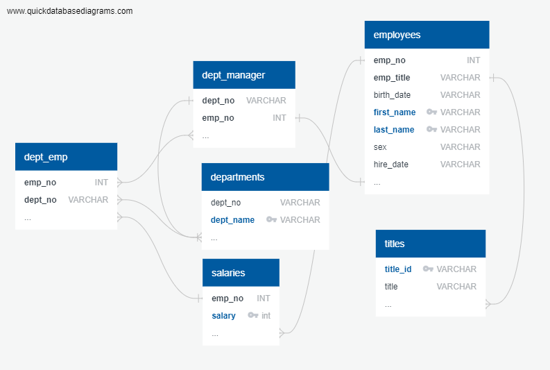

# sql-challenge

The purpose of this challenge is to display knowledge of creating tables, importing csv files into the tables, and running queries on those tables using SQL.

The challenge also required being able to create a proper entity relationship diagram (ERD) and import the diagram into the SQL database. The image below is the ERD that was created. 

